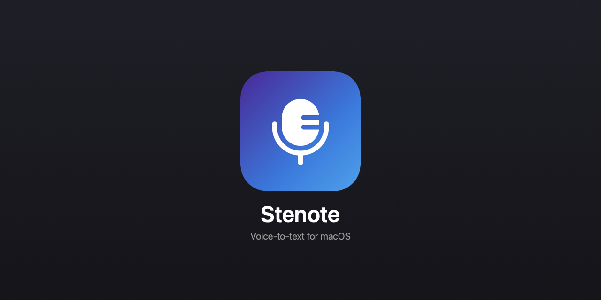
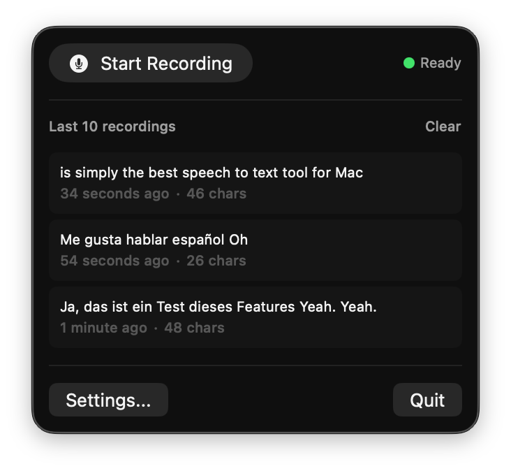

<p align="center">
  
</p>

# Talkman

**The voice-to-text app macOS should have built in.**

_Free for private use · 100% on-device · no cloud, no API keys._

Talkman is a native menubar app that turns your voice into text in any app. Speak, stop, and your words land at the cursor — everything runs on your Mac. Built on [NVIDIA Parakeet TDT 0.6B v3](https://huggingface.co/nvidia/parakeet-tdt-0.6b-v3) on the Apple Neural Engine (via the [FluidAudio SDK](https://github.com/FluidInference/FluidAudio)): faster than real-time, low hallucination, and 25 European languages auto-detected — even mixed in one sentence.

## How Talkman compares

| | Talkman | Apple Dictation | Wispr Flow | Whisper apps¹ |
|---|---|---|---|---|
| **Compute** | 🟢 On-device (ANE) | 🟢 On-device | 🔴 Cloud | 🟢 On-device |
| **Privacy** | 🟢 Never leaves your Mac | 🟢 On device | 🔴 Audio uploaded | 🟢 On device |
| **Price** | 🟢 Free, unlimited | 🟢 Free | 🟡 Free ~2k words/wk, then $15/mo | 🟡 Freemium or paid |
| **Languages** | 🟢 25, auto-detected, mixable | 🟡 Manual switch | 🟢 100+ (cloud) | 🟡 Per-model / manual |
| **Accuracy** | 🟢 Parakeet TDT, low hallucination | 🔴 Cutoffs, no custom vocab | 🟢 Strong (cloud) | 🟡 Whisper hallucinates on silence |
| **Mute / pause music while recording** | 🟢 Mutes output + pauses Spotify/Music | 🔴 None | 🟡 Mutes output only | 🟡 superwhisper yes, MacWhisper no |
| **Footprint** | 🟡 16 MB app + ~460 MB model, then offline | 🟢 Built in | 🟡 Tiny, but always online | 🔴 ~1.5 GB models |
| **Design** | 🟢 Minimal menubar | 🟡 System feature | 🟢 Polished, AI commands | 🟡 Power features |

¹ superwhisper, MacWhisper.  ·  Legend: 🟢 strength · 🟡 mixed · 🔴 limiting

In short: Apple Dictation is private but weak, Wispr Flow is polished but cloud and paid, Whisper apps are local but heavier and hallucination-prone. Talkman is private, local, accurate, and free — without the trade-off.

## Features

- **Accuracy-first** — transcribes your full utterance on continuous context, then inserts it when you stop.
- **25 languages, auto-detected** — no switching, even mixing German and English mid-sentence.
- **Global hotkey** — double-press Right ⌥ by default (also Right ⌘, ⌥+Space, Fn+Space, F5, Fn/🌐; several can be active at once). Right-click the menubar icon to toggle.
- **Mute & pause media** — independently mute system audio and/or pause Spotify & Apple Music while recording (both on by default).
- **Word corrections** — custom replacements for names and jargon, with optional model boosting.
- **History** — click any entry to copy; length configurable, from none to unlimited.
- **Smart clipboard** — uses a concealed type so clipboard managers ignore pastes, and restores your clipboard afterward.
- **Also** — auto-stop on silence, paragraph breaks, prefix/suffix text, launch at login, menubar-only (no dock icon).
- **Updates** — *Manual* (no network calls, the default) or *Daily* (one lightweight GitHub check). No account, no telemetry.

<details><summary>All 25 languages</summary>

English, German, French, Spanish, Italian, Portuguese, Dutch, Polish, Czech, Romanian, Hungarian, Swedish, Danish, Finnish, Greek, Bulgarian, Croatian, Slovak, Slovenian, Estonian, Latvian, Lithuanian, Russian, Ukrainian, Maltese.

</details>

## Install

1. Download `Talkman-0.7.3.dmg` from the [latest release](https://github.com/youngpilot/Talkman/releases/latest).
2. Open it, drag **Talkman** to Applications, and launch.
3. Grant **Microphone** and **Accessibility** when prompted. The speech model (~460 MB) downloads once, then runs fully offline.

Requires **macOS 15.2+** and **Apple Silicon** (M1 or later).

> If macOS says the developer can't be verified, right-click the app → **Open**. (Released builds are notarized; this only affects copies you build yourself.)

## Usage

Double-press **Right ⌥** to start, speak, then press again — or let it auto-stop after silence — and the text lands wherever your cursor is. Left-click the menubar icon for settings; the icon turns red while recording.

<p align="center">
  
</p>

## Build from source

Swift 6 + SwiftUI. Requires **Xcode 16+** (developed on 26.5) and Apple Silicon.

```bash
DEVELOPER_DIR=/Applications/Xcode.app/Contents/Developer \
  xcodebuild -project Talkman.xcodeproj -scheme Talkman -configuration Debug build
```

The FluidAudio package resolves automatically; models download on first launch. For a signed build, set your own Apple Developer Team in *Signing & Capabilities*.

> `TalkmanIM/` is an experimental, not-yet-wired-in system-wide input method — optional, not needed to build or run Talkman.

## Credits

[NVIDIA Parakeet TDT v3](https://huggingface.co/nvidia/parakeet-tdt-0.6b-v3) (Apache 2.0) · [FluidAudio](https://github.com/FluidInference/FluidAudio) · icon [Solar](https://icon-sets.iconify.design/solar/) by 480 Design (CC BY 4.0).

## License

**Free for private use** under the [PolyForm Noncommercial License 1.0.0](LICENSE): any noncommercial use (personal, hobby, study). Commercial use is not permitted. © 2026 Julian Schiemann.
