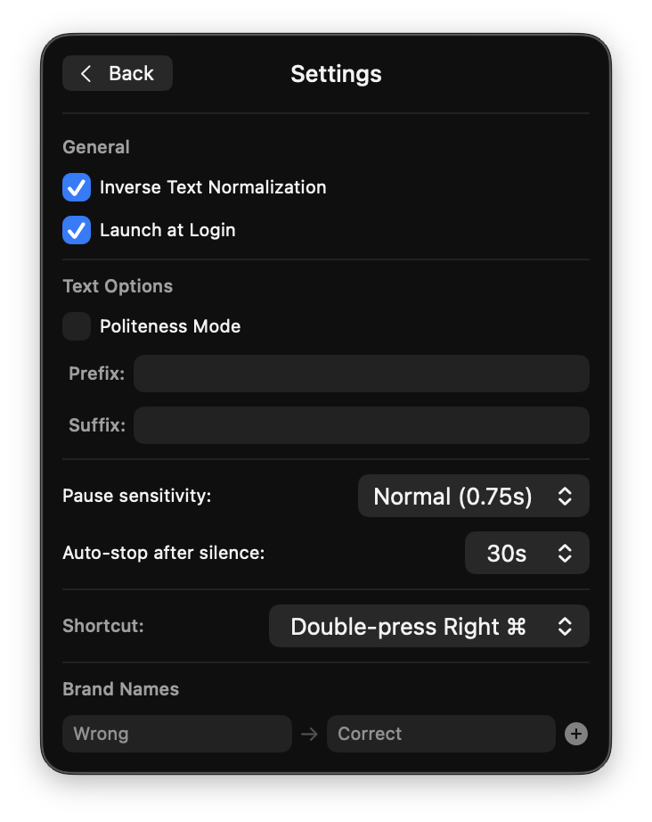

<p align="center">
  
</p>

# Talkman

**The voice-to-text app macOS should have built in.**

Talkman is a native menubar app that transcribes your voice in real time — directly into whatever app you're working in. No cloud. No API keys. No latency. Just speak and watch text appear instantly.

Built on [NVIDIA Parakeet TDT 0.6B v3](https://huggingface.co/nvidia/parakeet-tdt-0.6b-v3), running entirely on-device via Apple Neural Engine through [FluidAudio SDK](https://github.com/AntAudioIntelligence/FluidAudio). Transcription runs at **~120x real-time on M4 Pro** — faster than you can speak.

## Why Talkman

**Apple's built-in Dictation is slow, unreliable, and English-centric.** It sends your audio to Apple's servers, adds noticeable latency, frequently drops words, and struggles with accents, technical terms, and non-English languages.

Talkman fixes all of that:

- **Instant** — transcription happens on your Neural Engine in milliseconds, not seconds. No network round-trip, no waiting.
- **Accurate** — Parakeet TDT v3 is a state-of-the-art 600M parameter model trained on 86,000+ hours of speech. It handles accents, technical jargon, and natural speech patterns that Apple Dictation mangles.
- **Private** — your voice never leaves your Mac. Zero data sent anywhere. Ever.
- **Truly multilingual** — automatic language detection across 25 European languages with the same model, the same accuracy, no switching required:

  English, German, French, Spanish, Italian, Portuguese, Dutch, Polish, Czech, Romanian, Hungarian, Swedish, Danish, Finnish, Greek, Bulgarian, Croatian, Slovak, Slovenian, Estonian, Latvian, Lithuanian, Russian, Ukrainian, Maltese

- **Reliable** — no "I didn't catch that", no phantom words, no random stops. VAD-based speech detection means it transcribes exactly when you speak and stops exactly when you don't.

## Remove the Keyboard Bottleneck

Most people type at 40-80 WPM. You speak at 150+ WPM. Talkman closes that gap — everything you'd normally type, you can now dictate at 2-3x the speed with zero accuracy loss.

**Best use cases:**

- **Writing emails and messages** — draft replies in seconds instead of minutes
- **Meeting notes and documentation** — speak your thoughts while they're fresh, get clean text instantly
- **AI prompting** — dictate complex prompts to ChatGPT, Claude, Cursor, or any LLM tool faster than you can type them. Describe what you want in natural speech — no more wrestling with keyboard input for multi-paragraph instructions
- **Coding comments and commit messages** — describe what your code does without breaking flow
- **Chat and Slack** — respond at the speed of conversation
- **Journaling and brainstorming** — capture ideas faster than you can think them through
- **Long-form writing** — articles, reports, specs — dictate the first draft, then edit
- **Accessibility** — for anyone with RSI, carpal tunnel, or motor impairments, voice input isn't a convenience — it's a necessity

Talkman works in **any text field, in any app** — your editor, browser, terminal, Notion, Slack, Mail, whatever has focus.

## Install

1. Download `Talkman-0.3.0.dmg` from the [latest release](https://github.com/youngpilot/Talkman/releases/latest)
2. Open the DMG and drag Talkman to Applications
3. Launch Talkman — grant Microphone and Accessibility permissions when prompted
4. The ASR model downloads automatically on first launch (~200MB)

Requires **macOS 15.2+** and **Apple Silicon** (M1 or later).

## Usage

1. **Double-press Right Cmd** (or your configured hotkey) to start recording
2. Speak naturally — Talkman detects speech pauses and transcribes on-device
3. Text is pasted live into whatever app was focused when you started
4. Press the hotkey again, or let auto-stop end the session after silence

You can also **right-click the menubar icon** to toggle recording, or **left-click** to open the settings panel.

The mic icon turns red while recording.

<p align="center">
  
  &nbsp;&nbsp;&nbsp;
  
</p>

## Features

- **Real-time transcription** — text appears live as you speak, triggered by natural speech pauses (VAD-based)
- **25 languages, auto-detected** — speak in any supported language and Talkman recognizes it automatically. No language switching needed.
- **Menubar-only** — lives in your menu bar, no dock icon, no windows, out of your way
- **Global hotkey** — double-press Right Cmd to toggle recording (configurable: Fn, F5, F6, Ctrl+Shift+Space)
- **Right-click to record** — right-click the menubar icon to start/stop recording
- **Smart clipboard** — uses concealed pasteboard type so clipboard managers (Maccy, Paste, Alfred) ignore transcription pastes; restores your clipboard after each session
- **Brand name corrections** — teach Talkman your brand names with custom word replacements + vocabulary boosting
- **Paragraph breaks** — automatically inserts paragraph breaks after 2.5s+ pauses
- **Auto-stop** — configurable silence timeout (10s-60s or off)
- **Prefix/suffix text** — automatically prepend or append text to each transcription
- **Transcription history** — last 10 recordings, click to copy
- **Launch at Login** — via SMAppService

## Requirements

- macOS 15.2+
- Apple Silicon (M1 or later) — runs inference on Neural Engine
- Microphone permission
- Accessibility permission (for simulating Cmd+V paste into target apps)

## Tech Stack

- Swift 6 + SwiftUI
- FluidAudio SDK 0.12.2 (Parakeet TDT v3 CoreML, Silero VAD, CTC vocabulary boosting)
- Apple Neural Engine for inference
- AVAudioEngine for mic capture (16kHz mono)
- CGEvent for paste simulation
- NSEvent global monitors for hotkey detection

## Building from Source

```bash
xcodebuild -project Talkman.xcodeproj -scheme Talkman -configuration Debug build
```

Models are downloaded automatically on first launch (~200MB).

## Credits

- Menubar icon: [Solar](https://icon-sets.iconify.design/solar/) by 480 Design (CC BY 4.0)
- ASR model: [NVIDIA Parakeet TDT](https://huggingface.co/nvidia/parakeet-tdt-0.6b-v3) (Apache 2.0)
- Audio SDK: [FluidAudio](https://github.com/AntAudioIntelligence/FluidAudio)

## License

MIT
